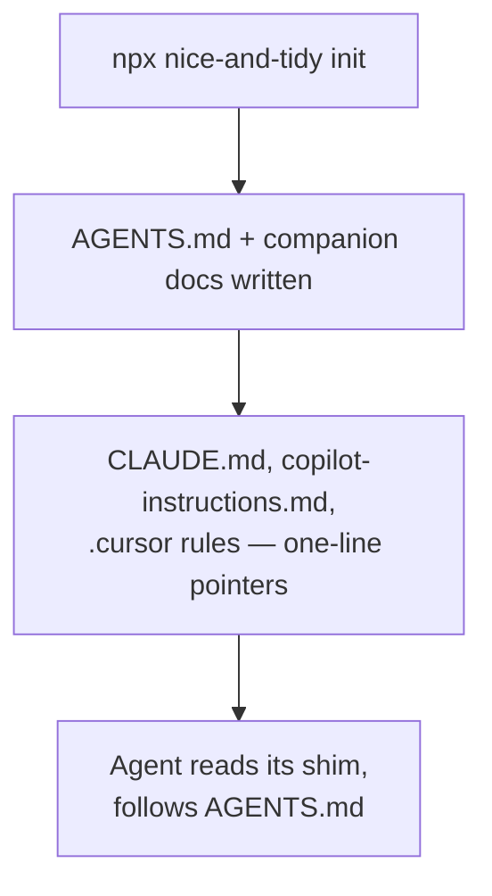
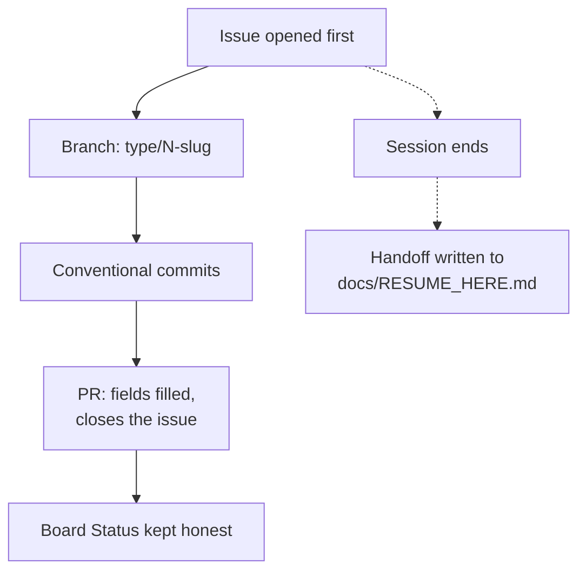
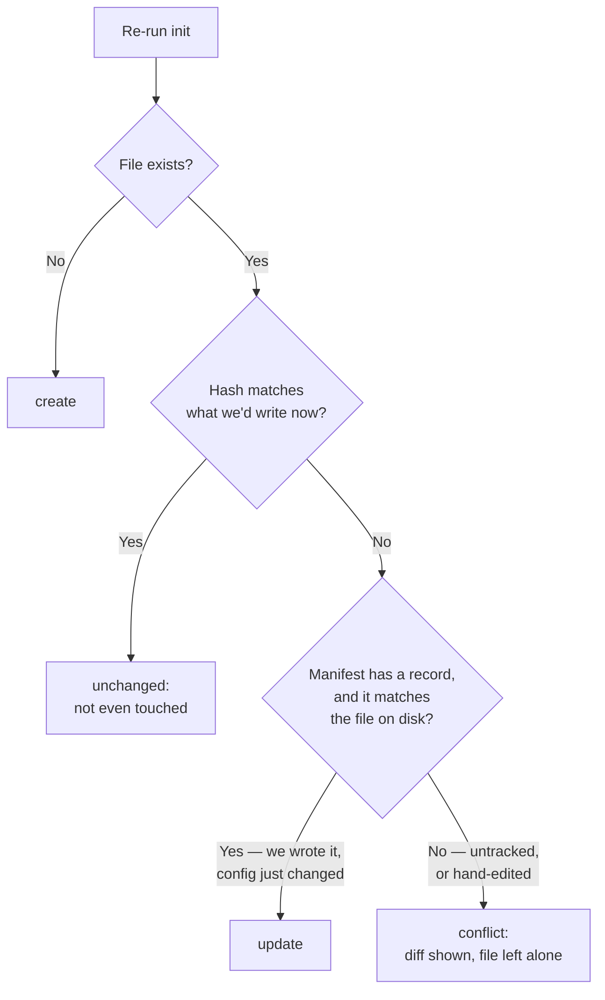

# nice-and-tidy

Install an issue-first Git workflow and an AI session protocol into any repo, for any
coding agent.

```bash
npx nice-and-tidy init
```

## TLDR

- **What it does**: one command writes a set of instruction files (`AGENTS.md` +
  companions) that teach any coding agent — Claude, Copilot, Cursor, whatever's next —
  to work issue-first: open the issue, cut a conventionally-named branch, write
  conventional commits, fill every PR field, and keep the board honest.
- **What you get**: a workflow (branch naming, commit convention, PR/board hygiene)
  and a response protocol (terse replies, session handoff through a committed file
  instead of scattered GitHub comments).
- **Zero runtime dependencies.** `npx` is a genuine cold start — nothing to download
  beyond the package itself.
- Both were hand-derived on a real repo over several days. This exists so they don't
  have to be re-derived per project.
- **Safe to re-run.** Files you've hand-edited are never silently overwritten — see
  [Re-running is safe](#re-running-is-safe).
- **Two honest limits**: nothing lints commit messages (it's a convention, not a
  gate), and `bootstrap` can't create a Project board because GitHub exposes no API
  for cloning the board template — it prints the three manual steps instead.

## Example

```
$ npx nice-and-tidy init
nice-and-tidy · local install
  /path/to/yourrepo

  create     nice-and-tidy.config.json
  create     AGENTS.md
  create     docs/WORKFLOW.md
  create     docs/BRANCHING.md
  create     docs/COMMIT_CONVENTIONS.md
  create     docs/SESSION_PROTOCOL.md
  create     CLAUDE.md
  create     .claude/skills/nice-and-tidy/SKILL.md
  create     .github/copilot-instructions.md
  create     .cursor/rules/nice-and-tidy.mdc
  create     docs/RESUME_HERE.md

  11 created.
```

`.nice-and-tidy/manifest.json` is written alongside these but isn't itself a planned
file, so it doesn't get its own line — 12 files on disk, 11 reported. Nothing on
GitHub was touched — that's `bootstrap`'s job. Run it again and every line above
becomes `unchanged`, because nothing changed.

Open a fresh chat with any of those agents afterward and ask it to pick up an issue —
it now knows to cut `feature/42-your-slug`, commit as `feat(cli): …`, and fill the PR
template before asking you to review.

## How it fits together



Once an agent is following `AGENTS.md`, every session runs the same cycle:



Everything an agent needs to behave this way lives in the repo it's working in — no
service to authenticate against, no daemon to keep running.

## Status

`init`, `diff` and `bootstrap` all work. 124 tests, mostly negative — an engine whose
job is "do not destroy the user's work" is only trustworthy if something proves it
refuses to.

## What `init` writes

| Path | What it is |
|---|---|
| `AGENTS.md` | The canonical instructions. Everything else points here. |
| `docs/WORKFLOW.md` | The issue → PR → board process, in full — the companion `AGENTS.md` §1–5 summarize. |
| `docs/BRANCHING.md` | The branch table and naming rule, structurally different under `gitflow: true`/`false`. |
| `docs/COMMIT_CONVENTIONS.md` | The commit type table and format. |
| `docs/SESSION_PROTOCOL.md` | Why replies are concise and sessions hand off through a file — the rationale `AGENTS.md` §6–7 and the Skill's operational rules point back to. |
| `CLAUDE.md` | A one-line import of `AGENTS.md`, plus notes for sessions that can act on the repo directly. |
| `.github/copilot-instructions.md` | Pointer. |
| `.cursor/rules/nice-and-tidy.mdc` | Pointer. |
| `.claude/skills/nice-and-tidy/SKILL.md` | The workflow as an invocable skill, with the shell commands spelled out. |
| `nice-and-tidy.config.json` | Yours, after the first write. Never rewritten. |
| `docs/RESUME_HERE.md` (or wherever `protocol.memoryFile` points) | A starter scaffold, created once if nothing is there. Yours after that, same as the config — a real session's notes are never diffed or flagged as a conflict, whatever they say. |
| `.nice-and-tidy/manifest.json` | Provenance. Commit it — see below. |

There's no Windsurf shim: Windsurf reads a root `AGENTS.md` natively, and its own
docs describe `.windsurfrules` as the deprecated file that support replaced — shipping
one would be dead weight, not defense in depth. Every entry in `targets` is a claim
about what a third-party tool reads *today*, so each is worth re-checking against that
tool's own docs; native `AGENTS.md` support is exactly the kind of thing that lands in
a point release and turns a useful shim into dead weight.

The instruction files never name a specific agent or product. Depth is gated by
capability instead: *"if you can run shell commands…"*, *"if your session can compact
its own context…"*. An agent with every capability listed gets the full experience
without the copy ever singling it out. A test enforces this.

`init` makes no network calls and touches nothing on GitHub. Creating labels,
milestones, the PR template and the board is `bootstrap`'s job.

## Re-running is safe

This is the part most scaffolding tools get wrong in one of two directions —
clobbering your edits, or never being able to update anything again.

Every file written is recorded in `.nice-and-tidy/manifest.json` as `path → sha256`.
On a re-run, each file falls into one of these buckets:



`nice-and-tidy.config.json` and the memory file skip this decision tree entirely —
they're yours from the first write (`kept`), never diffed, whatever they say.

Comparing the file to what we'd write cannot distinguish "you edited this" from "your
config changed" — both differ from what's on disk. Only a record of what was last
written tells those apart, which is why the manifest exists and why it should be
committed: a fresh clone without it treats every generated file as foreign and stops
to ask about all of them.

When a conflict comes up:

- In a terminal, you're asked per file. Enter keeps your version.
- Without a terminal, nothing is written and the exit code is `1`.
- `--keep-existing` applies everything else and leaves conflicts alone. Exit `0`.
- `--force` overwrites them.

A skipped conflict stays a conflict. Nothing silently adopts a file you edited.

## Commands

```bash
nice-and-tidy init          # write the instruction files and the config
nice-and-tidy diff          # show what init would change, write nothing
nice-and-tidy bootstrap     # GitHub-side setup: PR template, gate, CI, labels, milestones
```

| Flag | |
|---|---|
| `-g, --global` | Install for the current user instead of the current repo. |
| `--dry-run` | Same as `diff`. |
| `--keep-existing` | Apply everything except conflicts. |
| `--force` | Overwrite conflicts without asking. |
| `--gitflow` / `--no-gitflow` | Branch model. Only applies when creating the config. |

Exit codes: `0` fine, `1` unresolved conflicts, `2` bad usage or bad config, `3`
`bootstrap` only — `gh` is missing or not logged in, and nothing was contacted.

### `bootstrap`

Everything `init` deliberately doesn't touch, because it needs the network:

| What | Notes |
|---|---|
| `.github/pull_request_template.md` | Through the same plan/manifest pipeline as `init`'s files — your edits are diffed and asked about, not clobbered. |
| `scripts/check-pr-description.mjs` + `.github/workflows/pr-description.yml` | A dependency-free gate that fails a PR whose template sections are still the guidance comments. |
| `.github/workflows/ci.yml` | A minimal npm starting point. Adjust it. |
| Labels and milestones | Created from config, skipping any that already exist. Re-runnable. |

It needs `gh` installed and authenticated, and exits `3` without touching anything if
that isn't true. The default-branch flip under `gitflow: true` is **printed, never
run** — that's a repo-wide change a human should make deliberately.

No Project board is created. `gh project create` only produces a blank project, and
the GraphQL mutation that could clone a template needs a source ID GitHub doesn't
expose to a token. `docs/WORKFLOW.md` documents the three manual steps instead.

### `--global`

Writes `~/.claude/skills/nice-and-tidy/SKILL.md` and a reference copy of `AGENTS.md`
under `~/.config/nice-and-tidy/`. Nothing loads a machine-wide `AGENTS.md` on its own,
and the command says so rather than implying it wired something up. Per-repo installs
are what agents actually read.

## Config

`nice-and-tidy.config.json`, at the repo root. Written once by `init`, yours after
that.

```json
{
  "repo": "owner/name",
  "defaultAssignee": "githubusername",
  "gitflow": true,
  "milestones": ["Phase 1"],
  "labels": ["bug", "enhancement"],
  "scopes": ["cli", "docs"],
  "board": { "projectNumber": null, "template": "team-planning" },
  "targets": ["agents-md", "claude", "copilot", "cursor"],
  "protocol": {
    "concise": true,
    "memoryFile": "docs/RESUME_HERE.md",
    "statusBlockEveryResponse": true
  }
}
```

- `repo` and `defaultAssignee` are filled in from your `origin` remote on first run.
- `gitflow: false` degrades the branch model to trunk-based: no `develop`, short-lived
  branches straight into `main`.
- `targets` defaults to all of them. A shim is a few lines pointing at `AGENTS.md`;
  the only reason to drop one is a tool that already reads `AGENTS.md` natively, where
  the shim would be dead weight.
- `protocol.memoryFile` is where session handoff is written. It must stay inside the
  repo and be markdown — both are validated.

## Session memory never touches GitHub

Issue and PR *fields* — status, labels, milestone, assignee, links — are real project
data and keep being updated on GitHub as the workflow describes.

An agent's running account of its own sessions is not project data. It goes in
`protocol.memoryFile` and nowhere else: no issue comments, no PR comments, no board
notes. GitHub stays exactly as readable to a human as it would be if no agent had ever
been involved.

There is no option to change this.

## What is not enforced

The commit convention is a convention. Nothing lints commit messages, and the
generated docs say so rather than implying a gate that isn't there. If drift becomes a
real problem, a commit-message hook is the natural fix.

## Development

Zero runtime dependencies, deliberately — `npx` should be a cold start with nothing to
download. Node 20.19+.

```bash
npm test
```

124 tests, mostly negative. An engine whose job is "do not destroy the user's work" is
only trustworthy if something proves it refuses.

## Licence

MIT.
